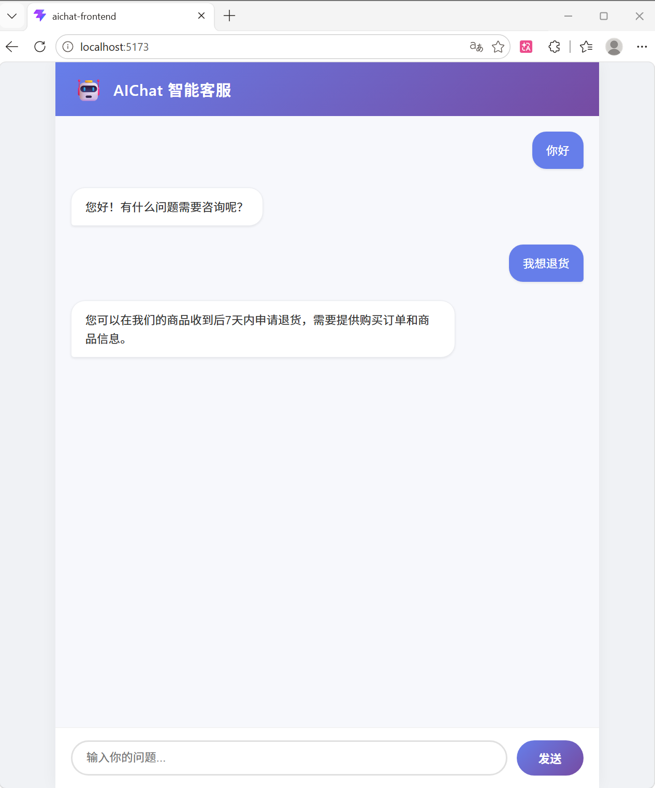

# AIChat —— 智能客服与知识库平台

[](LICENSE)

## 📖 项目简介
一个集成**文档上传**、**向量语义检索**及**AI自动总结**的智能客服平台。针对文档解析长耗时与高并发资源冲突痛点，基于 **RocketMQ** 实现异步处理，并通过 **Elasticsearch 混合检索**提升问答准确率。



## 🛠 技术栈
- **后端：** SpringBoot 3.2、MySQL 8.0、Redis 7.0、RocketMQ 5.5、Elasticsearch 8.x、MyBatis-Plus、Redisson、Caffeine
- **前端：** Vue3 + Vite + Element Plus
- **AI 模型：** 硅基流动 BGE-Large-ZH（向量化）、Qwen2.5-7B-Instruct（对话）

## ✨ 核心功能
- 📁 **文档管理**：上传知识库文档，异步解析并向量化存储至 Elasticsearch。
- 🔍 **混合搜索**：结合 BM25 关键词匹配与向量语义相似度，Top3 命中率 92%。
- 🤖 **智能对话**：基于知识库内容，调用大模型生成精准答案，支持多轮对话记忆。
- ⚡ **异步处理**：RocketMQ 削峰填谷，上传接口响应时间压缩至 50ms。
- 🛡️ **安全与限流**：Redisson 分布式锁、滑动窗口限流，防止恶意刷取。

## 📦 环境要求
- JDK 17
- Maven 3.9+
- MySQL 8.0
- Redis 7.0
- RocketMQ 5.5.0
- Elasticsearch 8.x
- Node.js 18+ （运行前端）

## 🚀 本地开发与启动

### 1. 克隆项目
```
git clone https://github.com/Jingemm/AIChat.git
```

### 2. 初始化数据库
- 在 MySQL 中创建数据库 aichat，执行以下 SQL：
```
CREATE DATABASE aichat DEFAULT CHARACTER SET utf8mb4;
USE aichat;
-- 表结构见 sql/init.sql（或直接粘贴下面两行）
CREATE TABLE document (id BIGINT AUTO_INCREMENT PRIMARY KEY, title VARCHAR(255) NOT NULL, content LONGTEXT, file_type VARCHAR(50), status INT DEFAULT 0, create_time DATETIME DEFAULT CURRENT_TIMESTAMP, update_time DATETIME DEFAULT CURRENT_TIMESTAMP ON UPDATE CURRENT_TIMESTAMP);
CREATE TABLE chat_history (id BIGINT AUTO_INCREMENT PRIMARY KEY, session_id VARCHAR(64) NOT NULL, role VARCHAR(20) NOT NULL, content TEXT NOT NULL, create_time DATETIME DEFAULT CURRENT_TIMESTAMP, INDEX idx_session (session_id));
```

### 3. 修改配置文件
- 打开 src/main/resources/application.yml，填入：
- spring.datasource.password（MySQL 密码）
- ai.embedding.api-key / ai.llm.api-key（API Key）

### 4. 一键启动所有服务
- 双击项目根目录下的 start-all.bat（Windows）。
- ⚠️ 首次使用前，需用文本编辑器打开脚本，根据注释修改 Redis、RocketMQ、Elasticsearch 的实际路径或者手动启动（顺序）：
- 启动 MySQL、Redis、RocketMQ NameServer + Broker、Elasticsearch
- 启动后端：mvn spring-boot:run
- 启动前端：cd frontend && npm install && npm run dev

### 5. 访问系统
- 打开浏览器 → http://localhost:5173

## 📡 接口示例
- 上传知识文档
```curl -X POST http://localhost:8080/documents/upload \
  -F "title=退货政策" \
  -F "file=@test.txt"
```

- 智能问答
```
- curl -X POST http://localhost:8080/chat \
  -d "sessionId=test001" \
  -d "question=怎么退货"
```

## 📂 项目结构
text
```
AIChat
├── src/main/java/com/aichat
│   ├── controller/
│   ├── service/
│   └── ...
├── frontend/
├── pom.xml
└── README.md
```

## 📄 License
MIT

---

## 一键启动脚本 `start-all.bat`（同样保持简洁）

```batch
@echo off
echo ========== AIChat 一键启动 ==========
REM 请修改下面的路径为你本机的实际路径

:: 1. Redis
start "Redis" /min "D:\path\to\Redis\redis-server.exe"

:: 2. RocketMQ
start "NameServer" /min cmd /c "cd /d D:\path\to\rocketmq\bin && mqnamesrv.cmd"
timeout /t 3 >nul
start "Broker" /min cmd /c "cd /d D:\path\to\rocketmq\bin && mqbroker.cmd -n localhost:9876 -c ../conf/broker.conf"

:: 3. Elasticsearch
start "ES" /min cmd /c "cd /d D:\path\to\elasticsearch\bin && elasticsearch.bat"

:: 等待中间件就绪
echo 等待服务启动(30秒)...
timeout /t 30 >nul

:: 4. 后端
cd /d "D:\AIChat\projects\aichat"
start "Backend" /min cmd /c "mvn spring-boot:run"

:: 5. 前端
cd /d "D:\AIChat\projects\aichat\frontend"
start "Frontend" /min cmd /c "npm run dev"

echo ========== 启动完成 ==========
echo 后端: http://localhost:8080
echo 前端: http://localhost:5173
pause

使用方法：将 D:\path\to\... 全部替换成本地电脑上对应的实际文件夹路径，保存后双击运行即可。

